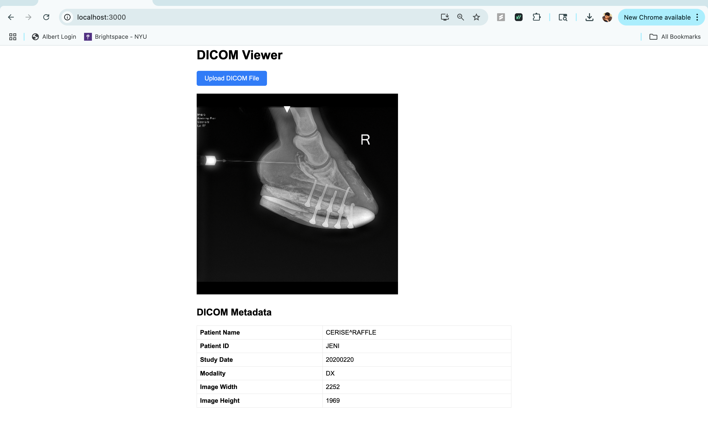

# DICOM Viewer Web App

This project is a simple web application that allows users to upload and view DICOM medical images directly in the browser. Built with React and the Cornerstone.js suite, it displays both the image and important metadata from the uploaded DICOM file. This tool is ideal for demonstrating basic medical imaging workflows and DICOM file handling in a modern web environment.

---

## Project Structure

The project is organized for clarity and scalability. Here’s an overview of the key files and folders:

- **public/index.html:** The HTML template loaded by React.
- **src/components/DicomViewer.js:** Handles DICOM file upload, image rendering, and metadata extraction.
- **src/App.js:** Renders the main viewer component.
- **src/index.js:** Entry point for the React app.
- **src/index.css:** Styles for the app.
- **package.json:** Lists dependencies like React, Cornerstone.js, and scripts for running the project.

---

## How to Run the Project

Follow these steps to set up and run the DICOM Viewer on your local machine:

### 1. Prerequisites

- [Node.js](https://nodejs.org/) (v14 or newer recommended)
- [npm](https://www.npmjs.com/) (comes with Node.js)
- A modern web browser (Chrome, Firefox, Edge, Safari)
- At least one DICOM file (`.dcm`) for testing

### 2. Installation

Clone the repository or download the source code, then install the dependencies:

*git clone https://github.com/Sandeep2229/dicom-viewer-app*

*cd dicom-viewer-app*

*npm install*

### 3. Running the App

Start the development server:

*npm start*

This will launch the app in your default browser at [http://localhost:3000](http://localhost:3000).

### 4. Using the Viewer

- Click the "Upload DICOM File" button.
- Select a `.dcm` file from your computer.
- The DICOM image and its metadata will be displayed on the page.
---

